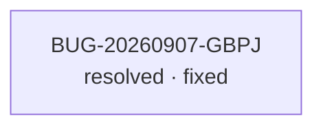

<!-- GENERATED, DO NOT EDIT: regenerado por /reversa-debugger-graph em 2026-09-08T13:32:32-0300 a partir de 1 bugs -->

# Grafo de bugs — contexto emissao-documentos-pdf

## Grafo mermaid

Nenhuma aresta entre bugs: não há relações `supported`/`confirmed` declaradas.

## Clusters

- Bug único no contexto `emissao-documentos-pdf`, sem encadeamento estrutural.

## Impact score (heurística de triagem)

Nenhum bug aberto neste contexto — sem score calculável. Heurística:
`causados*3 + bloqueados*2 + regressões*4 + relacionados*1`, contando apenas arestas
`supported`/`confirmed` (peso de `related-to` limitado a 3 no total). Não substitui priority/severity.
