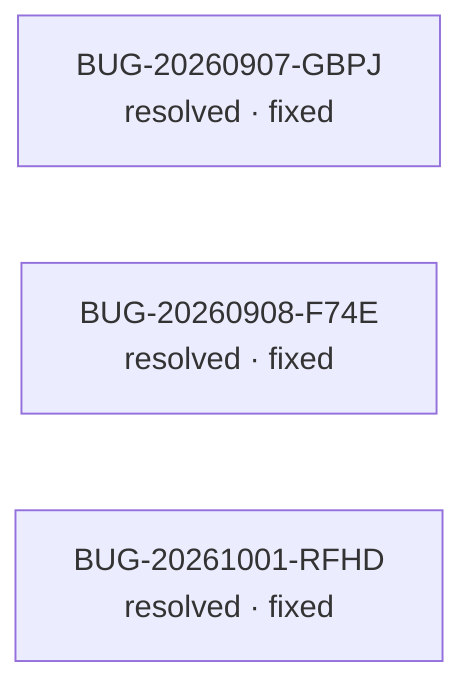

<!-- GENERATED, DO NOT EDIT: regenerado por /reversa-debugger-graph em 2026-10-01T09:00:00-0300 a partir de 3 bugs -->

# Grafo de bugs — contexto emissao-documentos-pdf

## Grafo mermaid

```mermaid
graph LR
    B1["BUG-20260907-GBPJ<br/>resolved · fixed"]
    B2["BUG-20260908-F74E<br/>resolved · fixed"]
    B4["BUG-20261001-RFHD<br/>resolved · fixed"]
```

Nenhuma aresta entre bugs: não há relações `supported`/`confirmed` declaradas.

## Clusters

- 3 bugs resolvidos no contexto `emissao-documentos-pdf`, todos no `pdf-service.ts`
  (geradores de documento). Sem encadeamento estrutural declarado; o cluster é de
  componente (o mesmo arquivo concentra geração de PDFs), não de causa.
- BUG-20261001-RFHD é o de maior severidade (high): documento oficial (Ata) sem
  identificação dos alunos.

## Impact score (heurística de triagem)

Nenhum bug aberto neste contexto — sem score calculável. Heurística:
`causados*3 + bloqueados*2 + regressões*4 + relacionados*1`, contando apenas arestas
`supported`/`confirmed` (peso de `related-to` limitado a 3 no total). Não substitui priority/severity.
