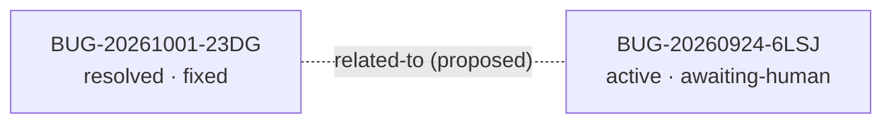

<!-- GENERATED, DO NOT EDIT: regenerado por /reversa-debugger-graph em 2026-10-01T12:20:00-0300 a partir de 2 bugs -->

# Grafo de bugs — contexto pagina-de-usuarios

## Grafo mermaid

Arestas `proposed` aparecem tracejadas e não contam para o impact score.

## Clusters

- 2 bugs no mesmo componente de identidade/deduplicação (`perfis` /
  `scripts/dedup-*.mjs`). BUG-20261001-23DG foi fechado por reparo de dados (consolidação de
  PESSOA C), com adendo RB16. BUG-20260924-6LSJ segue ativo (listagem e identidade no código).
  A causa estrutural comum é a ausência de identidade única por pessoa (dedup por CPF é
  insuficiente).

## Impact score (heurística de triagem)

| Bug | Score | Composição |
|-----|-------|-----------|
| BUG-20260924-6LSJ | 0 | nenhuma aresta `supported`/`confirmed` |

Heurística: `causados*3 + bloqueados*2 + regressões*4 + relacionados*1`, contando apenas
arestas `supported`/`confirmed` (peso de `related-to` limitado a 3 no total). A relação
23DG↔6LSJ é `proposed`, portanto não pontua. Não substitui priority/severity.
