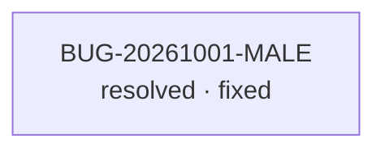

<!-- GENERATED, DO NOT EDIT: regenerado por /reversa-debugger-graph em 2026-10-01T13:15:00-0300 a partir de 1 bug -->

# Grafo de bugs — contexto professor-turmas

## Grafo mermaid

Nenhuma aresta entre bugs.

## Clusters

- 1 bug resolvido no contexto `professor-turmas`, no eixo da tela de lançamento de notas e,
  por consequência, do PDF do professor.

## Impact score (heurística de triagem)

Nenhum bug aberto neste contexto — sem score calculável. Heurística:
`causados*3 + bloqueados*2 + regressões*4 + relacionados*1`, contando apenas arestas
`supported`/`confirmed` (peso de `related-to` limitado a 3 no total). Não substitui priority/severity.
