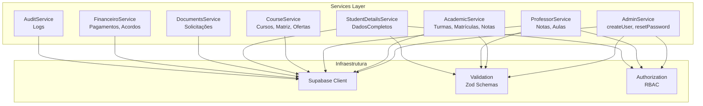
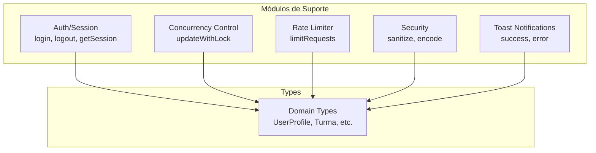

# C4 - Componentes — secretary_escola_csm

> Nível 3: Componentes Internos do SPA

---

## Services Layer (Componentes Principais)

---

## Módulos de Suporte

---

## Componentes por Módulo

| Serviço | Funções Principais | Dependências |
|---------|-------------------|--------------|
| **AdminService** | createUserByAdmin, matricularAluno, updateAluno, resetUserPassword | supabaseAdmin, AuditService |
| **AcademicService** | getTurmas, matricularAluno, getDisciplinasDaTurma, upsertNotaEstagio | supabase |
| **ProfessorService** | getDisciplinasDoProfessor, salvarNota, registrarAula | supabase, AuditService, Concurrency |
| **CourseService** | getCursos, getMatrizCurricular, criarOfertaDisciplina | supabase |
| **StudentDetailsService** | getAlunoCompleto, getEndereco, getResponsaveis, getObservacoes | supabase, Concurrency |
| **DocumentsService** | createRequest, getMyRequests, getAllOpenRequests | supabase |
| **FinanceiroService** | getResumo, getInadimplentes, criarAcordo | supabase |
| **AuditService** | log, getLogs, getCountsBySeverity | supabase, session |

---

## Views (Pages)

| View | Arquivo | Descrição |
|------|---------|-----------|
| Login | `login.ts` | Autenticação |
| Signup | `signup.ts` | Registro |
| Dashboard | `dashboard.ts` | Painel principal |
| Secretaria | `SecretariaView.ts` | Gestão administrativa |
| Student Details | `student-details.ts` | Dados completos do aluno |
| Professor Details | `professor-details.ts` | Dados do professor |
| Gestao Turmas | `gestao-turmas.ts` | Turmas e matrículas |
| Financeiro | `financeiro.ts` | Controle financeiro |
| Documents | `documents.ts` | Solicitações |
| Audit Log | `audit-log.ts` | Logs de auditoria |