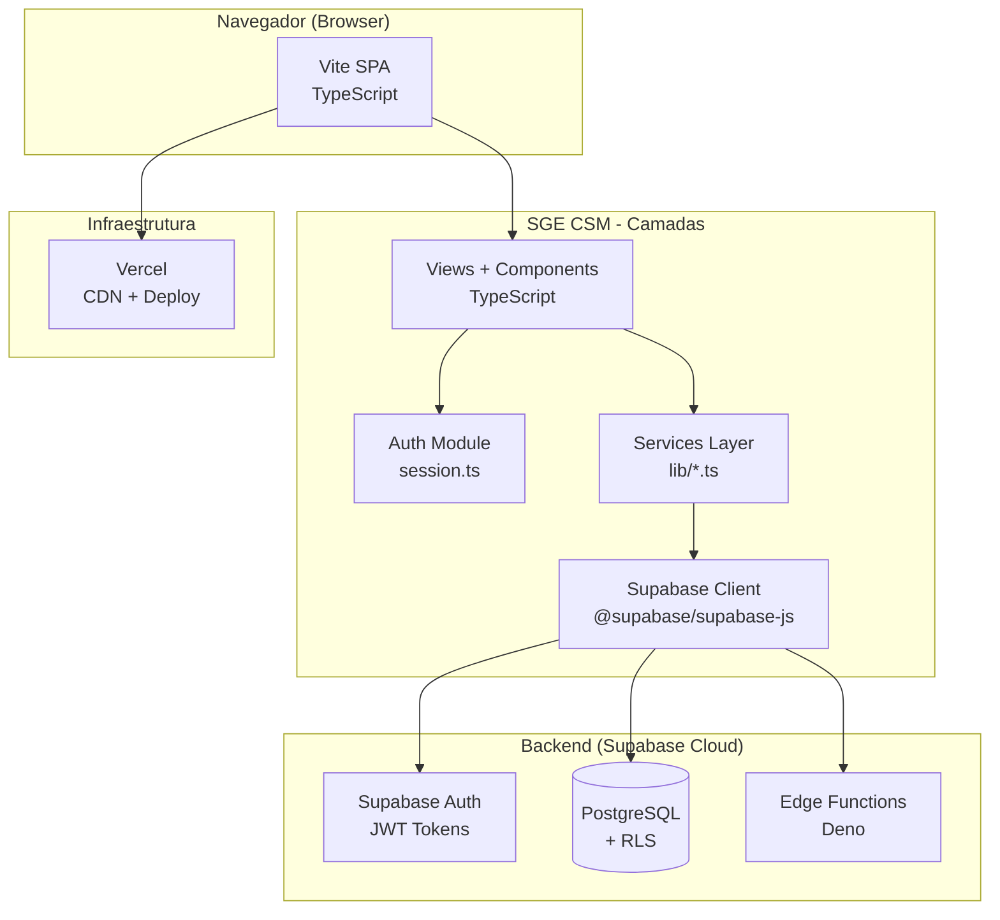

# C4 - Containers — secretary_escola_csm

> Nível 2: Aplicações e Serviços

---

---

## Containers Detalhados

| Container | Tecnologia | Responsabilidade |
|-----------|------------|------------------|
| **SPA** | Vite + TypeScript | Aplicação frontend completa |
| **Views** | TypeScript | Páginas: login, dashboard, secretaria, etc. |
| **Components** | TypeScript | Modal, TabelaAlunos, Tabs |
| **Auth Module** | session.ts | Login, logout, session, profile |
| **Services** | lib/*.ts | Lógica de negócio: admin, academic, professor, etc. |
| **Supabase Client** | @supabase/supabase-js | Cliente HTTP para API Supabase |
| **Auth (BE)** | Supabase Auth | Gerenciamento de usuários e tokens |
| **Database** | PostgreSQL + RLS | Persistência com segurança em nível de linha |
| **Edge Functions** | Deno | Operações privilegiadas: create user, reset password |
| **Vercel** | Vercel | Deploy e CDN |

---

## Comunicação entre Containers

| De | Para | Protocolo | Dados |
|----|------|-----------|-------|
| Views | Auth Module | Função JS | Session, profile |
| Views | Services | Função JS | Dados de negócio |
| Services | Supabase Client | Função JS | Queries, mutations |
| Supabase Client | Auth (BE) | HTTPS + JWT | Autenticação |
| Supabase Client | Database | HTTPS + RLS | CRUD |
| Supabase Client | Edge Functions | HTTPS + JWT | Operações admin |