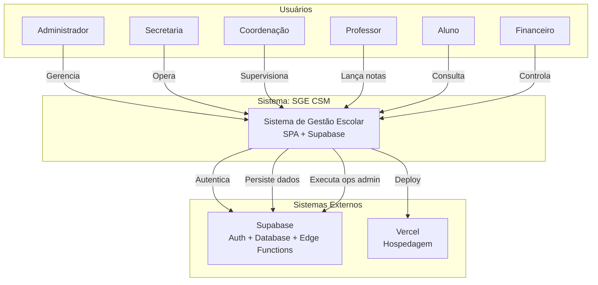

# C4 - Contexto — secretary_escola_csm

> Nível 1: Sistema no Centro

---

---

## Descrição dos Atores

| Ator | Descrição | Capabilities |
|------|-----------|--------------|
| **Admin** | Gestão total do sistema | CRUD usuários, reset senhas, configurações |
| **Secretaria** | Operações pedagógicas | Matrículas, turmas, documentos |
| **Coordenação** | Supervisão pedagógica | Professores, notas, relatórios |
| **Professor** | Operação docente | Notas, frequência, aulas |
| **Aluno** | Consumo | Histórico, documentos, disciplinas |
| **Financeiro** | Controle financeiro | Pagamentos, acordos |

---

## Integrações

| Sistema | Protocolo | Tipo |
|---------|-----------|------|
| Supabase Auth | HTTPS + JWT | Autenticação |
| Supabase Database | HTTPS + PostgreSQL | Dados |
| Supabase Edge Functions | HTTPS + Deno | Operações Admin |
| Vercel | HTTPS | Hospedagem |