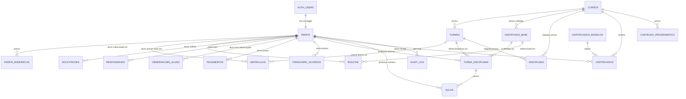
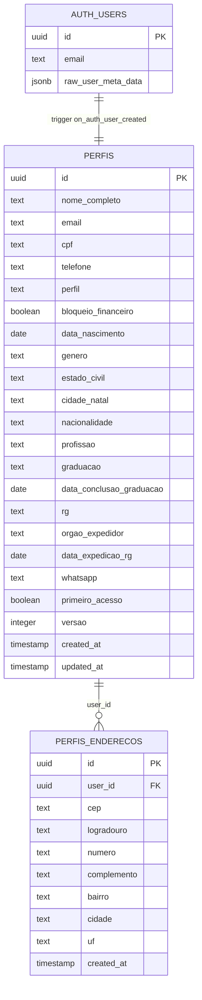
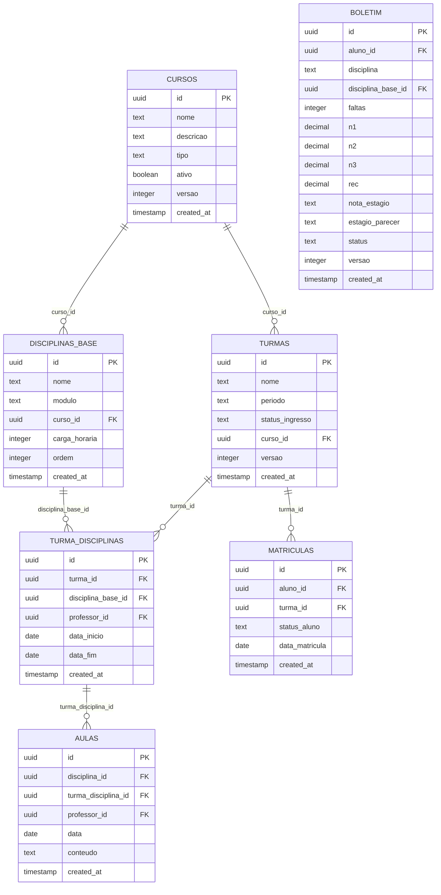
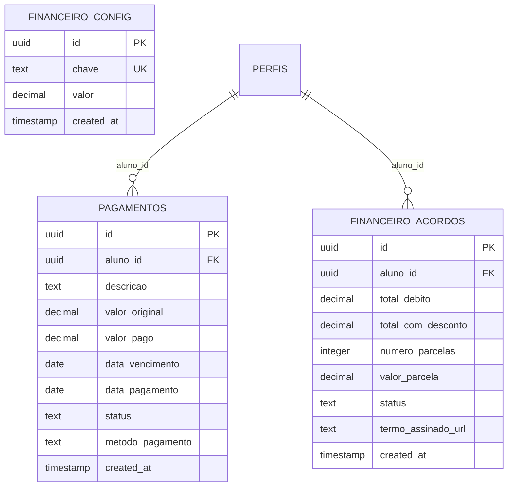
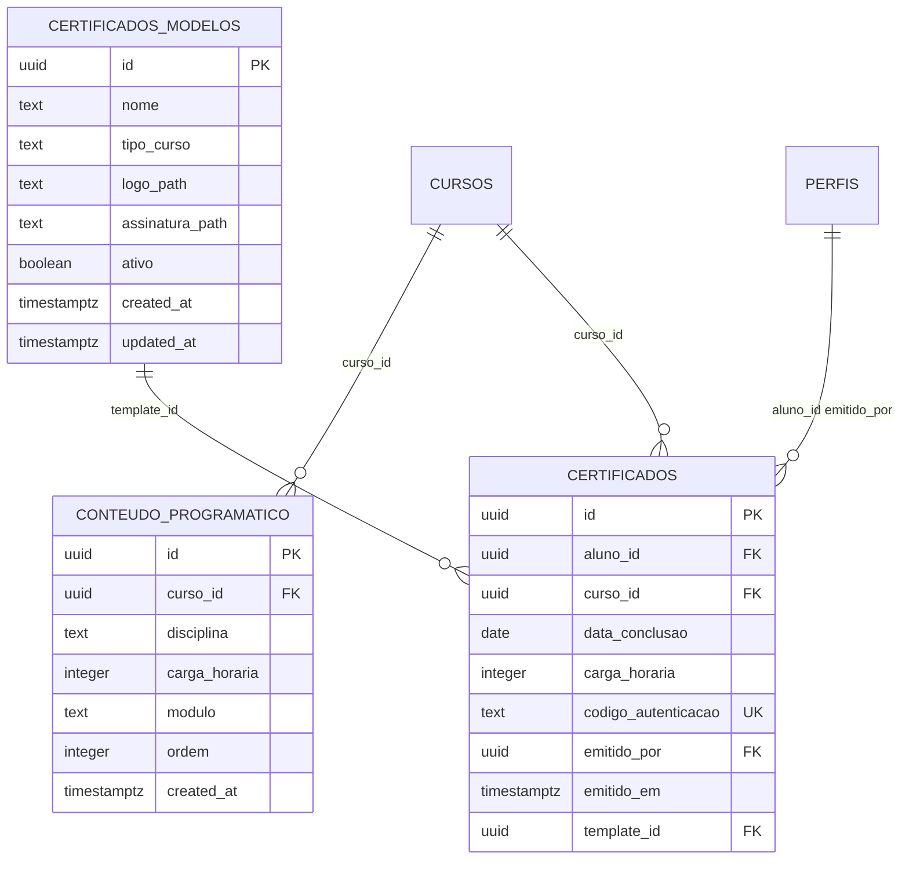
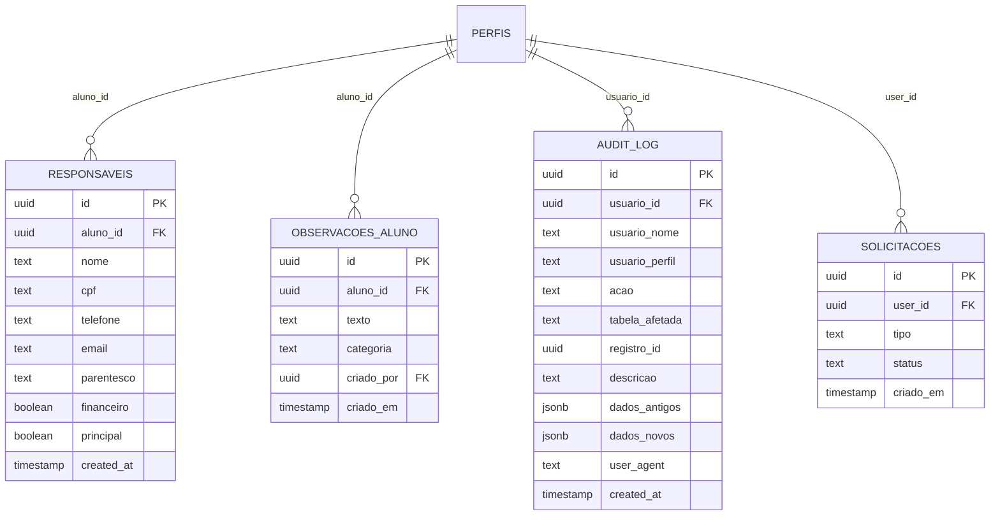

# ERD — Sistema de Gestão Escolar CSM

> 🟢 **CONFIRMADO** — Extraído diretamente de DDL (`schema.sql` v4.0, `migration.sql`, migrations em `supabase/migrations/`)
> Fonte: Supabase (PostgreSQL) — última atualização do schema: 2026-05-21

---

## ERD Geral (simplificado)

---

## ERD por Domínio

### Domínio: Identidade e Acesso

### Domínio: Acadêmico

### Domínio: Financeiro

### Domínio: Certificados

### Domínio: Suporte / Auditoria

---

## Tabela Legado

> 🟡 **INFERIDO** — Marcada explicitamente como legado no schema.sql

**DISCIPLINAS** — substituída por `disciplinas_base` + `turma_disciplinas`. Mantida por compatibilidade retroativa.

| Coluna | Tipo | Constraint |
|--------|------|-----------|
| id | UUID | PK |
| nome | TEXT | NOT NULL |
| modulo | TEXT | nullable |
| turma_id | UUID | FK → turmas (CASCADE) |
| professor_id | UUID | FK → perfis (SET NULL) |
| curso_id | UUID | FK → cursos (SET NULL) |
| versao | INTEGER | DEFAULT 1 |
| created_at | TIMESTAMP | DEFAULT NOW() |

> ⚠️ Esta tabela existe no banco mas **não é usada no código atual**.
