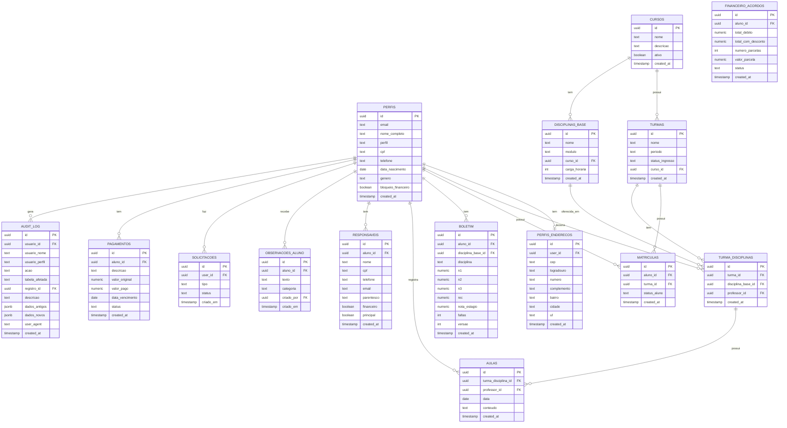

# ERD Completo — secretary_escola_csm

> Modelo de Dados com Relacionamentos

---

---

## Detalhamento de Entidades

### Entidades Centrais

| Entidade | Descrição | Qtd Campos |
|----------|-----------|------------|
| **perfis** | Usuários do sistema | 15+ |
| **turmas** | Turmas por curso | 6 |
| **matriculas** | Matrículas aluno-turma | 5 |
| **boletim** | Notas e frequência | 12 |
| **turma_disciplinas** | Ofertas (disciplina+turma+professor) | 5 |

### Entidades de Suporte

| Entidade | Descrição |
|----------|-----------|
| **perfis_enderecos** | Endereços de usuários |
| **responsaveis** | Responsáveis de alunos |
| **observacoes_aluno** | Anotações sobre alunos |
| **solicitacoes** | Pedidos de documentos |
| **pagamentos** | Débitos e pagamentos |
| **financeiro_acordos** | Acordos de pagamento |
| **audit_log** | Logs de auditoria |

---

## Chaves e Índices

### Primary Keys
- Todas as tabelas têm `id` como UUID PK

### Foreign Keys
- `matriculas.aluno_id` → `perfis.id`
- `matriculas.turma_id` → `turmas.id`
- `boletim.aluno_id` → `perfis.id`
- `turma_disciplinas.turma_id` → `turmas.id`
- `turma_disciplinas.disciplina_base_id` → `disciplinas_base.id`

### Índices Importantes
- `perfis.perfil` — para filtrar alunos, professores
- `matriculas.aluno_id + status_aluno` — para verificar matrícula ativa
- `boletim.aluno_id + disciplina_base_id` — para buscar notas
- `audit_log.created_at` — para ordenação temporal