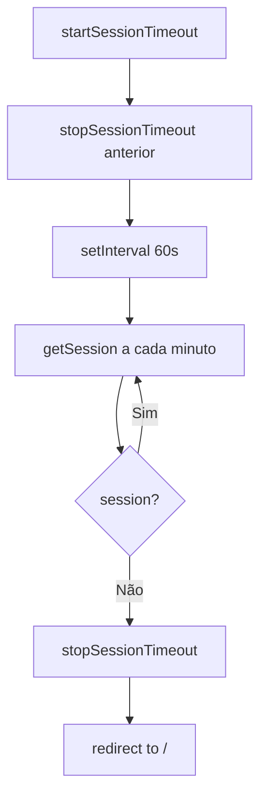

# Fluxograma — Auth

> Módulo: auth
> Complexity: medium

---

## Login

```mermaid
flowchart TD
    A[Login(email, password)] --> B[signInWithPassword]
    B --> C{error?}
    C -->|Sim| D[Return {error}]
    C -->|Não| E{session?}
    E -->|Não| F[Return {data: null}]
    E -->|Sim| G[startSessionTimeout]
    G --> H[Return {data, error}]
```

---

## Session Timeout



---

## GetSession com Timeout

```mermaid
flowchart TD
    A[getSession] --> B[supabase.auth.getSession]
    B --> C{session?}
    C -->|Não| D[Return {session: null}]
    C -->|Sim| E{recovery flow?}
    E -->|Sim| F[Skip timeout check]
    E -->|Não| G{sessionAge > 30min?}
    G -->|Sim| H[logout]
    H --> I[toast: Sessão expirada]
    I --> J[Return {session: null, error}]
    G -->|Não| K[Return {session, error}]
    F --> K
```

---

## RegisterUser

```mermaid
flowchart TD
    A[registerUser] --> B[signUp Supabase Auth]
    B --> C{error?}
    C -->|Sim| D[Return {error}]
    C -->|Não| E{user created?}
    E -->|Não| F[Return {error: 'Erro ao criar usuário'}]
    E -->|Sim| G[Insert into perfis]
    G --> H{error?}
    H -->|Sim| I[ROLLBACK: try delete user]
    I --> J[Return {error: 'Erro ao criar perfil'}]
    H -->|Não| K[Return {data, error: null}]
```

---

## ResetPassword

```mermaid
flowchart TD
    A[resetPassword(email)] --> B[Build redirectTo URL]
    B --> C[window.location.origin + /#/reset-password]
    C --> D[supabase.auth.resetPasswordForEmail]
    D --> E[Return {data, error}]
```