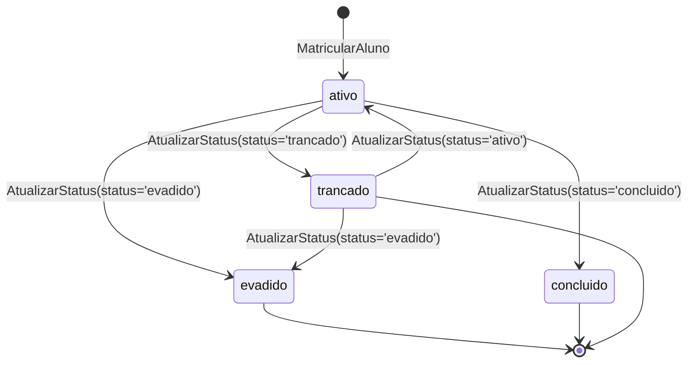
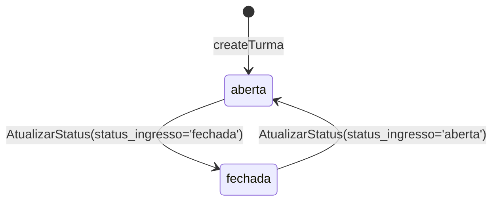
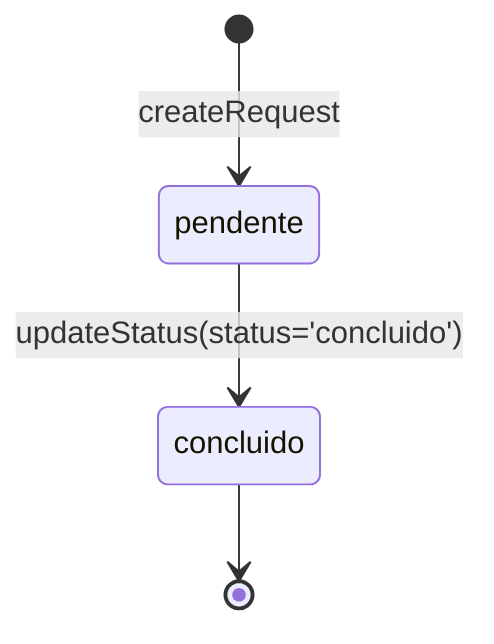
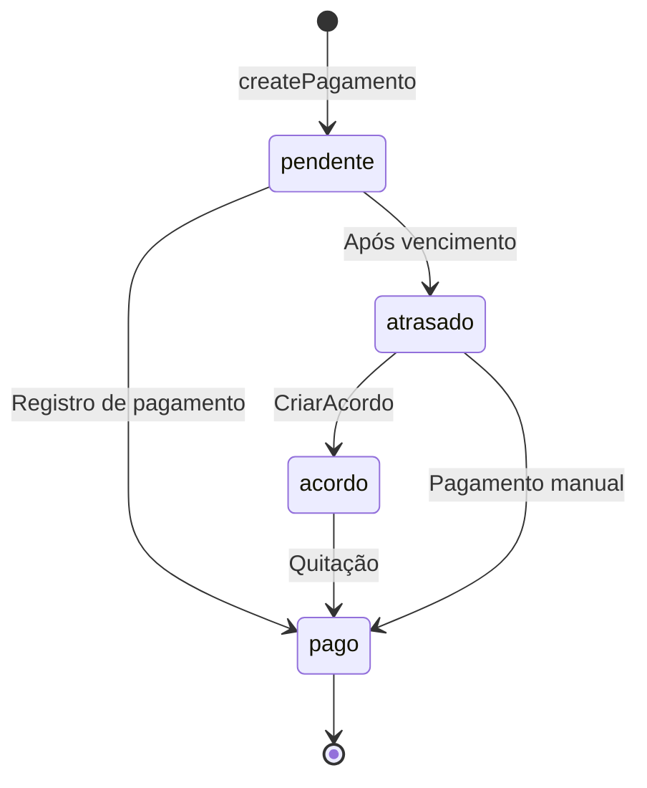
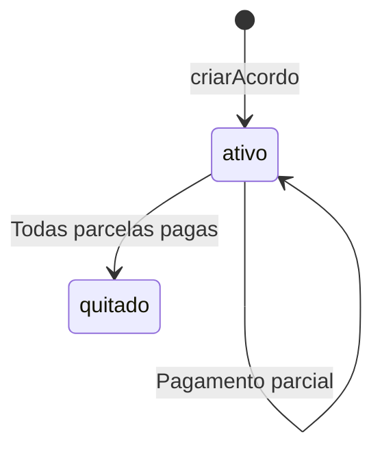
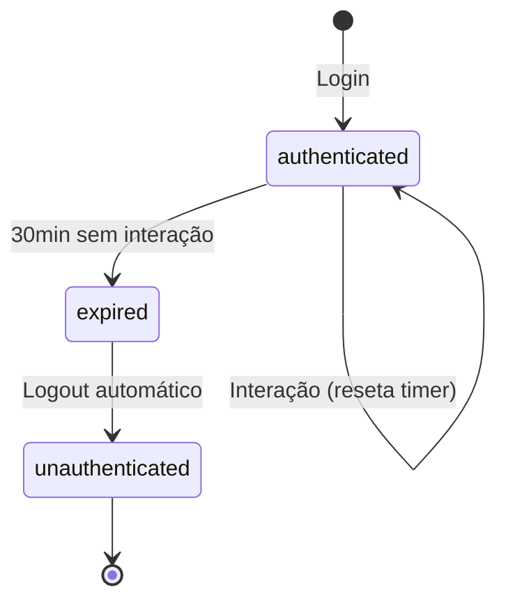
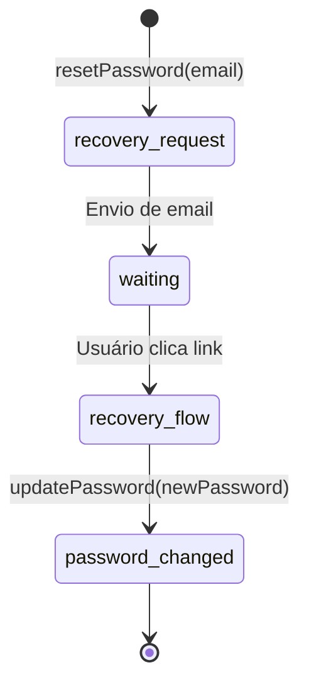

# Máquinas de Estado — secretary_escola_csm

> Gerado pelo Detective em 2026-05-19

---

## Entidade: Matrícula (status_aluno)

**Valores:** `ativo`, `trancado`, `evadido`, `concluido`

---

## Entidade: Turma (status_ingresso)

**Valores:** `aberta`, `fechada`

---

## Entidade: Solicitação (status)

**Valores:** `pendente`, `concluido`

---

## Entidade: Pagamento (status)

**Valores:** `pendente`, `pago`, `atrasado`, `acordo`

---

## Entidade: Acordo (status)

**Valores:** `ativo`, `quitado`

---

## Fluxo de Session (Timeout)

**Timeout:** 30 minutos (`SESSION_TIMEOUT_MS`)

---

## Fluxo: Reset de Senha

**Redirect:** `#/reset-password` com token na URL